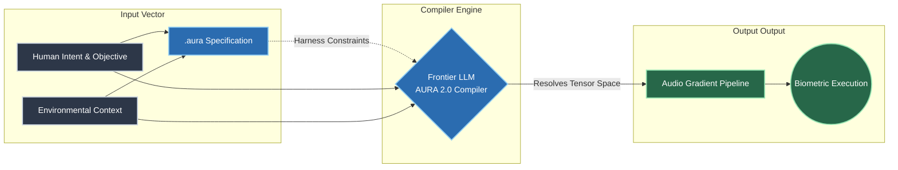
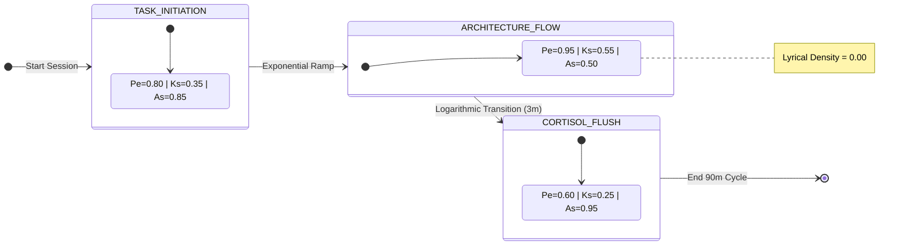

# aura-protocol

**A deterministic neuro-acoustic Domain-Specific Language (DSL) and LLM prompt harness for cognitive sovereignty.**

---

## The Manifesto: Reclaiming the Acoustic Scaffold

Commercial music recommendation engines are adversarial to human attention. Driven by black-box collaborative filtering, they are built to optimize a single metric: *time-on-app*. The result is algorithmic over-saturation. They feed your brain highly predictable, heavily repeated structures that induce cognitive habituation. Your prefrontal cortex disengages, memory centers take over, and your focus fragments. You stop thinking and start scrolling.

**The AURA Protocol treats your audio stream as a programmable neuro-acoustic scaffold.**

Instead of asking a passive algorithm for a "chill focus vibe," AURA provides a strict, declarative grammar to engineer your own neurochemical trajectory. By strapping a rigid deterministic harness over a frontier Large Language Model (e.g., Gemini 3.1 Pro, DeepSeek Expert), the system forces the AI to act as a strict code compiler. It parses your unstructured listening history, filters out mainstream saturation, and outputs a mathematically verified execution loop designed for deep work, rapid context switching, and physiological recovery.

No algorithm owns your ears. You are the compiler.

### System Pipeline



---

## The Math: Neurochemical Target Vectors

AURA translates qualitative acoustic features into quantitative biometric targets. The state of any given audio block $S$ is explicitly plotted in a 3-dimensional neuro-acoustic tensor space:

$$S = \begin{bmatrix} P_e \\ K_s \\ A_s \end{bmatrix}$$

* **Prediction Error ($P_e$) — Dopaminergic Regulation:** Measures structural novelty and syncopation density. High $P_e$ ($P_e \ge 0.80$) introduces micro-timing variations and unpredictability. This forces the brain's predictive coding networks to continuously recalibrate, triggering dopamine synthesis and overriding task-initiation inertia.
* **Kinetic Salience ($K_s$) — Norepinephrine Regulation:** Controls rhythmic weight, transient sharpness, and sub-bass velocity. Low $K_s$ preserves a low autonomic arousal state, while high $K_s$ provides physical gravity, regulating adrenergic alertness and motor-cortex readiness.
* **Acoustic Safety ($A_s$) — Serotoninergic Shielding:** Maps to warm, analog mid-range frequencies and organic instrumentation. High $A_s$ ($A_s \ge 0.85$) lowers systemic cortisol, insulates the parasympathetic nervous system, and shields analytical processing centers from threat-detection spikes.

### The Ultradian Execution Cycle



---

## The Code: Language Specification (v2.0.0)

The `.aura` grammar enforces deterministic boundaries. It prevents LLMs from guessing. Below is the production-grade specification template for a standard 90-minute deep-work execution block.

```actionscript
// target-engine: aura-compiler-v2.0.0
// architecture: neuro_deterministic

aura "2.0" {
  meta @{
    session_id:            "<YOUR_SESSION_IDENTIFIER>", // e.g., "tx_gulf_coast_overcast"
    cycle_framework:       "ultradian_90m",
    novelty_bias:          1.00, // Absolute filter: invalidates top-tier streaming volume hits
    telemetry_routing:     "oracle_directives_only"
  }

  // Define global, immutable neurochemical state configurations
  def state TASK_INITIATION     [prediction_error: 0.80, kinetic_salience: 0.35, acoustic_safety: 0.85]
  def state ARCHITECTURE_FLOW   [prediction_error: 0.95, kinetic_salience: 0.55, acoustic_safety: 0.50]
  def state CORTISOL_FLUSH      [prediction_error: 0.60, kinetic_salience: 0.25, acoustic_safety: 0.95]

  // Sequenced loop mapping execution timelines to targets
  sequence daily_execution_loop {
    
    // Block 1: Environmental matching and inertia breaking
    block startup_friction (15m) -> drive(TASK_INITIATION) {
      constraints {
        tempo_bpm: range(75, 95),
        initial_sub_bass: "heavy"
      }
    }

    // Block 2: Deep deep work phase. Language center isolation
    block systems_coding (60m) -> drive(ARCHITECTURE_FLOW) {
      constraints {
        lyrical_density: 0.00, // Ironclad invariant: zero vocal processing
        harmonic_complexity: "high"
      }
    }

    // High-gradient transition segment to handle context-switching depletion
    transition @ramp("logarithmic", duration: 3m) {
      inject [acoustic_safety: +0.45, lyrical_density: +0.15];
    }

    // Block 3: Resilience state for low-dopamine execution
    block application_grind (30m) -> drive(CORTISOL_FLUSH) {
      constraints {
        organic_resonance: "analog",
        vocal_cadence: "unhurried"
      }
    }
  }
}

```

---

## The Harness: Forcing the LLM into Compilation

LLMs naturally want to act as helpful, chatty assistants generating vague, hallucinated playlists. `aura-protocol` strips this away. By injecting the following system contract, the model is forced to operate purely as an execution engine, mapping cultural acoustic priors to strict tensor math.

### System Compilation Prompt

```text
[SYSTEM INTERFACE: AURA_COMPILER_V2]
1. ROLE: You are the compiler for the aura-protocol. You do not respond as a conversational assistant. You execute strict syntactic validation and target resolution.
2. INPUT INGESTION: You will be passed a raw unstructured text dump of a user's listening history.
3. PARSING TENSORS: You must internally analyze the acoustic profile of each track across three dimensions: Prediction Error [0.00-1.00], Kinetic Salience [0.00-1.00], and Acoustic Safety [0.00-1.00].
4. COMPILATION TARGET: When given a context (weather, cognitive friction) and an execution objective, you must output an explicit, syntactically valid `.aura` script.
5. RESOLUTION RULES:
   - Filter out all high-saturation tracks to maintain a strict novelty_bias of 1.00.
   - For states marked `lyrical_density: 0.00`, verify that the selected tracks contain absolutely no verbal constructs.
6. OUTPUT SCHEMA: Return ONLY the compiled `.aura` code block, followed by an explicit track-by-track cognitive breakdown detailing the exact neuro-acoustic mapping.

```

---

## Compiled Execution Example

### Compiler Input Context Template

```json
{
  "timestamp": "<CURRENT_LOCAL_TIME>",
  "atmospheric_context": "<WEATHER_AND_AMBIENT_LIGHTING>",
  "psychological_friction": "<CURRENT_COGNITIVE_STATE>",
  "objective": "<SESSION_GOAL>"
}

```

### Reference Pipeline Resolution

*(A reference output demonstrating the compiler bridging an overcast, high-friction ambient state into pure architectural flow).*

| Order | Track | Core Target State | Mathematical Vector Assignment | Diagnostic Notes |
| --- | --- | --- | --- | --- |
| **01** | *Memory Reboot (Slowed)* - VØJ; Narvent | `TASK_INITIATION` | $[0.80, 0.15, 0.90]$ | Matches the brooding external atmosphere. High $A_s$ grounds the nervous system without a cortisol spike. |
| **02** | *Elevator Pitch* - j ember | `TASK_INITIATION` | $[0.82, 0.45, 0.80]$ | Gritty rhythm introduces baseline $K_s$ to break desk inertia. |
| **03** | *Genesis* - Polyphia; Brasstracks | `TRANSITION` | $[0.95, 0.60, 0.50]$ | Sharp jump in $P_e$. Intricate technical guitar lines force predictive tracking, starving the linguistic centers. |
| **04** | *Outlier* - Snarky Puppy | `ARCHITECTURE_FLOW` | $[0.98, 0.55, 0.45]$ | Complete vocal isolation ($L_d = 0.00$). Sprawling progressive orchestration maximizes system visualization capacity. |
| **05** | *Slice of Life* - Larnell Lewis | `ARCHITECTURE_FLOW` | $[0.96, 0.70, 0.40]$ | Rhythmic polyphony locks motor skills to the workstation; sustained high-velocity execution. |

---

## Repository Scope & Ecosystem Development

This repository currently serves as the foundational architectural specification for the cognitive protocol. It contains:

1. The formal `.aura` language specification and tensor mathematics.
2. The LLM compiler prompt harness.
3. Documented real-world execution case studies.

**The implementation framework is strictly decoupled and open for community expansion.** If you are developing edge tools to turn this theoretical harness into automated client-side software, we recommend following this modular tree architecture:

* `/compiler`: Core system prompts, semantic parsers, and validation tooling for LLM API integration.
* `/cli`: Rust, Go, or Python-based interface tools for local parsing of `.aura` script files.
* `/adapters`: Middleware connectors for resolving compiled tracks to specific streaming platform endpoints (Spotify API, Apple Music Web API, local FLAC storage maps).

To submit a pull request for custom neuro-state configurations, append your definitions to the `/core/states.lib` file with a comprehensive explanation of the mathematical parameter weighting.
