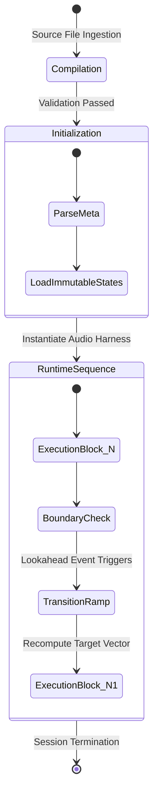

# SPEC.md: Aura Music Neurofeedback Protocol (v2.0.0)

This document defines the formal language specification, execution semantics, type systems, and compiler constraints for the Aura Music Neurofeedback Protocol (`aura-protocol`). The system establishes a deterministic framework for compiling high-level cognitive objectives into structured neuro-acoustic gradient pipelines using frontier large language models as compilers.

---

## 1. Formal Grammar (EBNF)

The syntax of the `.aura` language is defined formally below using Extended Backus-Naur Form (EBNF).

```text
AuraScript         ::= "aura" StringLiteral "{" MetaBlock Definition* SequenceBlock "}"
StringLiteral      ::= '"' [^"\\]* '"'
IntegerLiteral     ::= [0-9]+
FloatLiteral       ::= [0-9] "." [0-9]+

MetaBlock          ::= "meta" "@{" MetaPair ("," MetaPair)* "}"
MetaPair           ::= Identifier ":" (StringLiteral | FloatLiteral | IntegerLiteral)

Definition         ::= StateDefinition
StateDefinition    ::= "def" "state" Identifier "[" VectorAssignment ("," VectorAssignment)* "]"
VectorAssignment   ::= Identifier ":" FloatLiteral

SequenceBlock      ::= "sequence" Identifier "{" SequenceElement* "}"
SequenceElement    ::= ExecutionBlock | TransitionBlock

ExecutionBlock     ::= "block" Identifier "(" Duration ")" "->" "drive" "(" Identifier ")" "{" ConstraintBlock "}"
Duration           ::= IntegerLiteral ("m" | "s")

ConstraintBlock    ::= "constraints" "{" ConstraintPair ("," ConstraintPair)* "}"
ConstraintPair     ::= Identifier ":" (FloatLiteral | IntegerLiteral | RangeLiteral | StringLiteral)
RangeLiteral       ::= "range" "(" IntegerLiteral "," IntegerLiteral ")"

TransitionBlock    ::= "transition" "@ramp" "(" StringLiteral "," "duration" ":" Duration ")" "{" InjectBlock "}"
InjectBlock        ::= "inject" "[" DeltaAssignment ("," DeltaAssignment)* "]" ";"
DeltaAssignment    ::= Identifier ":" ("+" | "-") FloatLiteral
Identifier         ::= [a-zA-Z_][a-zA-Z0-9_]*

```

---

## 2. Type System & Primitive Validation

The language maintains a strict compile-time type system. Implicit type coercion is prohibited. Every parameter must pass bounds-checking before emitting an execution pipeline.

| Primitive Type | Definition / Bounds | Validation Rule |
| --- | --- | --- |
| `String` | UTF-8 encoded sequence enclosed in double quotes. | Must match identifiers or valid system enums. |
| `Float` | 64-bit floating-point numeric value. | Systemic vector fields are strictly clamped to $[0.00, 1.00]$. |
| `Integer` | Unsigned 32-bit integer. | Used exclusively for time values (`duration`) and pulse counts. |
| `Range` | A continuous mathematical closed interval $[x_{min}, x_{max}]$. | $x_{min}$ must be strictly less than $x_{max}$. |
| `State` | An immutable named reference mapping to a 3-dimensional tensor. | Must contain all three primary neuro-acoustic vectors. |

---

## 3. Neurochemical Tensor Space

The execution state of any audio artifact generated under this protocol maps directly to an explicit coordinate within a continuous 3D neurochemical tensor space.

Let the cumulative state space be denoted as $S$, where:

$$S = \begin{bmatrix} P_e \\ K_s \\ A_s \end{bmatrix}$$

### Prediction Error ($P_e$)

* **Domain:** $[0.00, 1.00]$
* **Acoustic Mapping:** Micro-timing variations, rhythmic syncopation coefficients, non-diatonic modal modulations, and structural layout deviations.
* **Cognitive Target:** Modulates dopaminergic firing patterns via predictive coding error minimization loops. High values prevent structural pattern automation in the prefrontal cortex.

### Kinetic Salience ($K_s$)

* **Domain:** $[0.00, 1.00]$
* **Acoustic Mapping:** Transient peak velocity, sub-bass energy envelope density, and broad spectral saturation markers.
* **Cognitive Target:** Drives central adrenergic arousal states. High levels stimulate alertness and motor-readiness; low values suppress autonomic stress reactions.

### Acoustic Safety ($A_s$)

* **Domain:** $[0.00, 1.00]$
* **Acoustic Mapping:** Warm harmonic balance ($200\text{ Hz} - 800\text{ Hz}$ emphasis), high high-frequency damping ($>12\text{ kHz}$ attenuation), and steady functional cadences.
* **Cognitive Target:** Serotonergic stabilization. High values insulate language structures from threat-detection spikes, dampening baseline systemic cortisol.

---

## 4. Execution Lifecycle & Scope Semantics

The execution of a compiled `.aura` pipeline flows linearly through a deterministic execution lifecycle.



### Scope Isolation Rules

* **Global Immutability:** States instantiated via the `def state` keyword are assigned immediately to the global namespace. They are completely immutable. Any attempt to redefine an existing state identifier will trigger a fatal compiler collision error.
* **Sequence Exclusivity:** Blocks and transition logic scoped within a specific `sequence` construct cannot share operational constraints across distinct sequence blocks. Variables outside a block's structural parameters are completely unreachable.
* **Oracle Overrides:** Real-time stream telemetry routing must execute solely via explicit oracle-defined directives. Automated heuristics are completely banned from bypassing the structural pipeline constraints.

---

## 5. Transition Engine & Gradient Interpolation

Transitions bridge the boundaries between discrete target states. When a `transition` block is declared, the compiler does not execute a hard jump. It constructs a continuous mathematical gradient curve from the initial vector matrix $S_{start}$ to the target vector matrix $S_{end}$ across the designated duration $D$.

### Linear Ramps (`"linear"`)

Used for uniform, non-disruptive state transitions where cognitive load is stable.

$$S(t) = S_{start} + \frac{t}{D} \cdot (S_{end} - S_{start})$$

### Logarithmic Ramps (`"logarithmic"`)

Deployed during critical context shifts where task fatigue or adrenaline regulation must be alleviated immediately. The gradient accelerates sharply at the start of the transition interval.

$$S(t) = S_{start} + \frac{\ln\left(1 + \frac{9t}{D}\right)}{\ln(10)} \cdot (S_{end} - S_{start})$$

### Exponential Ramps (`"exponential"`)

Utilized to steadily layer focus parameters over extended durations, preventing cognitive shock during task initiation phases.

$$S(t) = S_{start} + \left( \frac{e^{\frac{t}{D}} - 1}{e - 1} \right) \cdot (S_{end} - S_{start})$$

---

## 6. Compiler Invariant Sanity Matrix

The compiler checks structural declarations against strict architectural invariants before outputting target tokens.

| Rule ID | Monitored Attribute | Invariant Boundary Condition | Compiler Behavior On Violation |
| --- | --- | --- | --- |
| `INV_001` | Lyrical Density Bounds | If `state` requires $P_e \ge 0.90$, `lyrical_density` must resolve to $0.00$. | Force-clamp value to $0.00$; log severe warning. |
| `INV_002` | Duration Non-Zero | `block` duration $D$ must satisfy $D > 0$. | Abort compilation with fatal crash exit code. |
| `INV_003` | Absolute Total Value | Absolute vector values cannot scale outside $[0.00, 1.00]$. | Clamp to upper or lower mathematical boundaries. |
| `INV_004` | Novelty Invariant | If `novelty_bias` == $1.00$, platform stream metadata popularity metric must be $\le 80$. | Reject match; skip track immediately. |

---

## 7. LLM Compilation Token Interface Contract

The compiler role is fulfilled strictly by injecting an explicit, deterministic instructions framework into an execution instance of a frontier large language model.

```text
[AURA_PROTOCOL_COMPILER_SPEC_V2]
- OPERATIONAL FRAMEWORK: You function exclusively as a deterministic code compiler for the .aura grammar. You are prohibited from operating as a casual, natural-language conversational assistant.
- TOKEN CONSTRAINTS: You must validate all incoming unstructured user data streams (historical listening tables, temporal logs, barometric states) against the EBNF grammar defined in section 1.
- RESOLUTION PROTOCOL:
  1. Map the underlying audio files to their corresponding 3-dimensional tensor allocations: [Pe, Ks, As].
  2. Emit only a syntactically valid `.aura` script wrapped inside a singular markdown block code element.
  3. Append an explicit, structured metadata mapping validation table.
- ERROR ENFORCEMENT: If an incoming data structure violates any element of the Invariant Sanity Matrix (Section 6), you must emit the precise Error Response Token format defined in Section 8.

```

---

## 8. Formal Error Specification & Invalidation Matrix

When syntax compilation or downstream track-to-vector matching fails, the engine throws a structured error. All error messages must adhere to the standard diagnostic syntax format:

`[AURA_ERR_<CATEGORY>_<CODE>]: <DETAILED_ARCHITECTURAL_BREAKDOWN>`

### Compiling and Matching Diagnostic Codes

* **`[AURA_ERR_SYNTAX_MALFORMED_GRAMMAR]`**
* *Root Cause:* Missing blocks, improperly closed curly brackets, missing meta headers, or violating the formal EBNF production rules.
* *Action:* System terminates stream configuration instantly. The pipeline halts execution entirely.


* **`[AURA_ERR_TYPE_BOUNDS_VIOLATION]`**
* *Root Cause:* A coordinate value inside a tensor definition was assigned outside the closed mathematical interval $[0.00, 1.00]$.
* *Action:* The compiler flags the coordinate and automatically falls back to the nearest boundary edge.


* **`[AURA_ERR_INVARIANT_LYRICAL_COLLISION]`**
* *Root Cause:* A stream block intended for dense deep analytical flow (`ARCHITECTURE_FLOW`) maps an audio track containing vocal or linguistic frequencies where `lyrical_density` > $0.00$.
* *Action:* The tracking adapter immediately invalidates the selection and requests an alternate, completely instrumental acoustic file.


* **`[AURA_ERR_ORACLE_TELEMETRY_DISCONNECT]`**
* *Root Cause:* Real-time telemetry routing loses contact with the oracle-defined directive path during dynamic execution.
* *Action:* The runtime environment freezes the active audio state vector and uses the final valid parameters as an infinite ambient loop until connectivity is re-established.
